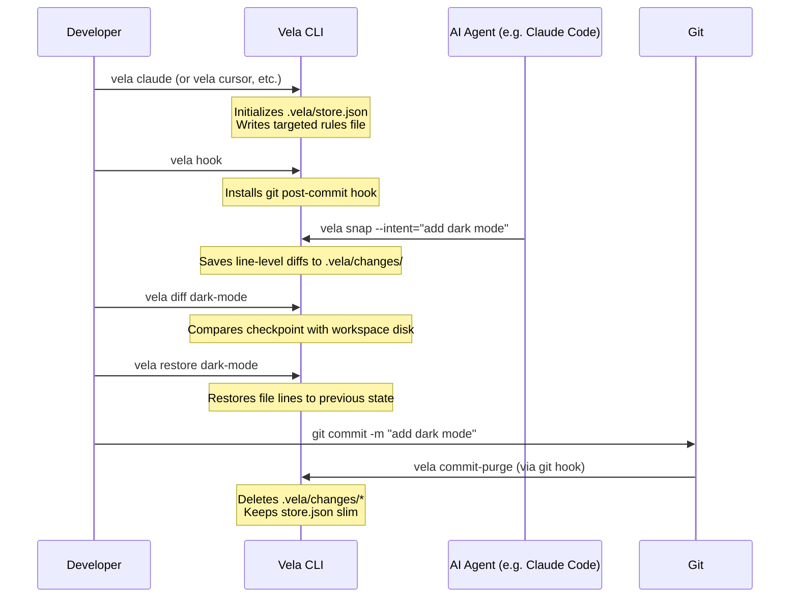

# Vela ⛵

[](https://www.npmjs.com/package/vela)
[](https://github.com/your-username/vela/blob/main/LICENSE)
[](https://www.npmjs.com/package/vela)

**Vela** is a lightweight, AI-friendly micro-version control system (VCS) companion. It is designed to work alongside Git to track codebase changes in real-time, generate targeted context rules for AI editors/agents, and orchestrate quick rollbacks during rapid feature development cycles.

---

## Key Capabilities

* **Targeted Context Injection**: Customize rules dynamically for **Claude Code, Cursor, Copilot, Windsurf, Antigravity, and Codex**.
* **Zero Bloat Diff Storage**: Saves only line-level diff hunks in `.vela/changes/` rather than copying entire files.
* **Automatic Clean Cycle**: Automatically purges active checkpoints and deletes changes files upon running `git commit` via post-commit hooks.
* **Granular Diff Inspection**: Compare workspace files line-by-line against local checkpoints before applying a restore.

---

## Architecture Flow



---

## Installation

Install globally via npm:
```bash
npm install -g vela
```

---

## Getting Started

### 1. Initialize Targeted Rules
Run the command corresponding to the AI editor or agent you are using. This configures the local store and injects rules explaining how your AI assistant can read checkpoints and trigger rollbacks:

```bash
# For Claude Code
vela claude

# For Cursor IDE
vela cursor

# For GitHub Copilot
vela copilot

# For Windsurf Editor
vela windsurf

# For Antigravity CLI
vela agy

# For generic Codex models
vela codex

# For all platforms
vela init
```

*Enable auto-purge by installing the Git post-commit hook:*
```bash
vela hook
```

---

## Command Reference & Typical Workflow

### 1. Snapshot State
When you (or your AI agent) start working on a feature, capture the working state:
```bash
vela snap --intent="implement auth"
```
* Generates a semantic codename: `amber-implement-auth-066c20`.
* Saves specific diff hunks under `.vela/changes/amber-implement-auth-066c20.json`.

### 2. Inspect Checkpoint Differences
Compare files on disk with the code stored in a checkpoint. You can use full codenames or convenient Git-like aliases (`last`, `prev`, `last~1`, `~2`, etc.):
```bash
# Diff using codename
vela diff implement-auth

# Diff using aliases (last checkpoint, 2nd-to-last checkpoint)
vela diff last
vela diff prev

# Diff a specific file
vela diff last package.json
```

### 3. Inspect File Contents
Inspect the line-by-line contents of a file inside the checkpoint database:
```bash
vela show last src/index.ts
```

### 4. Roll Back State
Revert workspace files back to a previous checkpoint:
```bash
# Revert to the last snap, or the one before it
vela restore last
vela restore last~1
```

### 5. Git Commit Integration
Once your changes are committed to Git, Vela automatically purges local history files to keep the directory completely clean:
```bash
git commit -am "feat: implement auth"
# Git hook automatically fires 'vela commit-purge'
```

---

## License

This project is licensed under the MIT License - see the [LICENSE](LICENSE) file for details.
