# Vela Complete User Guide & Process Documentation

Welcome to the comprehensive guide for **Vela**. This documentation explains the core architectural processes, workflows, and a step-by-step practical example in natural language.

---

## 1. Core Use Cases & Motivation

When pair-programming with AI coding assistants (like Claude Code, Cursor, or Copilot), the AI often makes rapid, multi-file edits. While fast, this can lead to:
1. **AI Drift**: The AI introduces bugs or strays from your design.
2. **Loss of History**: Git is too coarse for tracking every single prompt step; you don't want to create 50 Git commits for tiny AI iterations.
3. **State Bloat**: Storing complete backups of the codebase on every iteration slows down your editor and wastes disk space.

**Vela solves this** by acting as an **AI-friendly micro-VCS companion**:
* It tracks changes at the line level.
* It communicates snapshots to your AI editor via rules files.
* It cleans up after itself automatically when you make a Git commit.

---

## 2. Core Processes Explained

```mermaid
graph TD
    subgraph Initialization
        A[vela init / vela claude] --> B[Create .vela/store.json]
        B --> C[Write rules file e.g., CLAUDE.md]
    end
    subgraph Feature Loop
        D[vela snap] --> E[Calculate line-level diffs]
        E --> F[Save to .vela/changes/codename.json]
        F --> G[Strip content in store.json to save space]
    end
    subgraph Restore
        H[vela restore last~1] --> I[Load content from .vela/changes/codename.json]
        I --> J[Overwrite local files on disk]
    end
```



### Process A: Initialization
* **Subcommands**: `vela init`, `vela claude`, `vela cursor`, `vela copilot`, `vela windsurf`, `vela agy`, `vela codex`.
* **What it does**: Creates the `.vela/` directory and initializes `store.json`. It saves your preferred AI tool targets.
* **Target Files**: Based on your target tool, it writes rules manifests (`CLAUDE.md`, `.cursorrules`, etc.) containing explicit instructions telling the AI how to rollback changes automatically using Vela commands.

### Process B: Snapshotting (`snap`)
* **What it does**: Captures the current codebase state.
* **Diff Compression**: Instead of bloating `store.json` with full file backups, Vela compares your current files with the previous checkpoint, extracts only the modified line hunks, and writes them to `.vela/changes/<codename>.json`.
* **Database Stripping**: Older checkpoints inside `store.json` are stripped of their raw file contents (saving disk space), while the most recent HEAD checkpoint retains contents to allow calculating the next diff.

### Process C: Inspection (`log`, `show`, `diff`)
* **`vela log`**: Retrieves the checkpoint history chain from HEAD back to baseline.
* **`vela show <ref> <file>`**: Retrieves the code of a specific file at a checkpoint. If it's stripped from `store.json`, it dynamically pulls the content from `.vela/changes/<codename>.json`.
* **`vela diff <ref> [file]`**: Performs a structured patch diff of the checkpoint version against your current working directory.

### Process D: Rollback (`restore`)
* **What it does**: Overwrites files on disk with the code from a target checkpoint.
* **Safe Undo**: Before applying the rollback, Vela automatically snapshots your current workspace as a rollback checkpoint, so you can revert the rollback itself if you change your mind.

### Process E: Commit-Purging (`commit-purge` / `hook`)
* **What it does**: Cleans up all temporary databases.
* **Git Hook Integration**: Once you run `git commit`, the post-commit hook triggers `vela commit-purge`. This deletes all files under `.vela/changes/` and purges the active checkpoints from `store.json`, leaving you with a clean, lightweight directory for the next feature.

---

## 3. Step-by-Step Practical Example

Let's walk through a realistic, natural language scenario where a developer uses Vela to build a feature with an AI coding agent.

### The Scenario
You want to implement a new **Dark Mode** toggle in your web application. You will have the AI agent do this, but you want to ensure you can revert immediately if the AI breaks your CSS.

---

### Step 1: Set up Vela
Open your terminal in the project root and run:
```bash
# Initialize targeting Claude Code & install git hook
vela claude
vela hook
```
*Vela creates `.vela/store.json` and `CLAUDE.md`, configuring the system.*

---

### Step 2: Establish a Baseline
Before letting the AI make edits, capture your working baseline:
```bash
vela snap --intent="baseline before dark mode"
```
*Vela generates a checkpoint codename like `slate-baseline-before-dark-mode-4f2a`.*

---

### Step 3: Let the AI edit the codebase
You tell Claude Code:
> "Hey Claude, modify `src/app.css` and `src/index.html` to add a dark mode toggle button."

Claude edits the files.

---

### Step 4: Snapshot the AI's changes
The AI finishes, and you want to lock in the state so you don't lose it:
```bash
vela snap --intent="add dark mode toggle css"
```
*Vela generates `amber-add-dark-mode-toggle-css-9a1b.json` under `.vela/changes/`, storing exactly the css rules added.*

---

### Step 5: AI goes too far
You ask the AI to make a second change:
> "Now, add theme state persistence to localStorage."

The AI edits `src/app.ts`. You test the app, but theme switching is now broken, and your CSS is messed up.

---

### Step 6: Inspect and compare
You want to check the differences between the current broken state and your working CSS checkpoint (`amber-add-dark-mode-toggle-css`):
```bash
# View the changes to see what CSS was modified
vela diff prev src/app.css
```
You see the CSS files are completely different.

---

### Step 7: Restore the last working state
Instead of trying to manually debug the AI's changes, you roll back to the state right before the localStorage edit:
```bash
vela restore prev
```
*Vela instantly overwrites your files back to the stable CSS toggle checkpoint, restoring order.*

---

### Step 8: Commit the completed feature
Now that the CSS is back to normal and you are happy with the feature, commit it to Git:
```bash
git commit -am "feat: add dark mode css toggle"
```
*The Git post-commit hook fires automatically, deleting all local files under `.vela/changes/` and resetting the active Vela checkpoints. Your workspace is clean and ready for your next coding session!*
